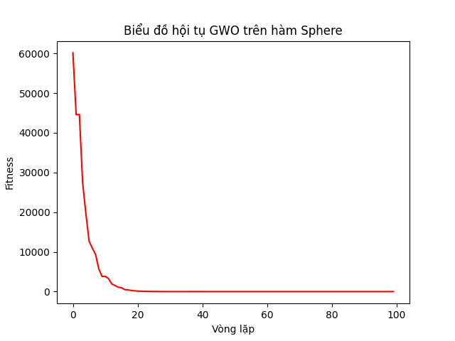

# GWO Implementation for Wireless Sensor Networks (Demo)

## Giới thiệu
Đây là mã nguồn demo thuật toán **Grey Wolf Optimizer (GWO)** được thực hiện bởi nhóm 65.
Dự án minh họa việc áp dụng GWO để giải quyết bài toán tối ưu hóa hàm mục tiêu cơ bản (Sphere Function), mô phỏng cho bài toán tối ưu năng lượng trong mạng cảm biến.

## Cấu trúc
- `GWO_Demo_Sphere.py`: Mã nguồn chính triển khai thuật toán GWO bằng Python.
- Hàm mục tiêu: Sphere Function ($F(x) = \sum x^2$).
- Result

## Cách chạy
Yêu cầu cài đặt thư viện `numpy` và `matplotlib`:
```bash
pip install numpy matplotlib
python main.py